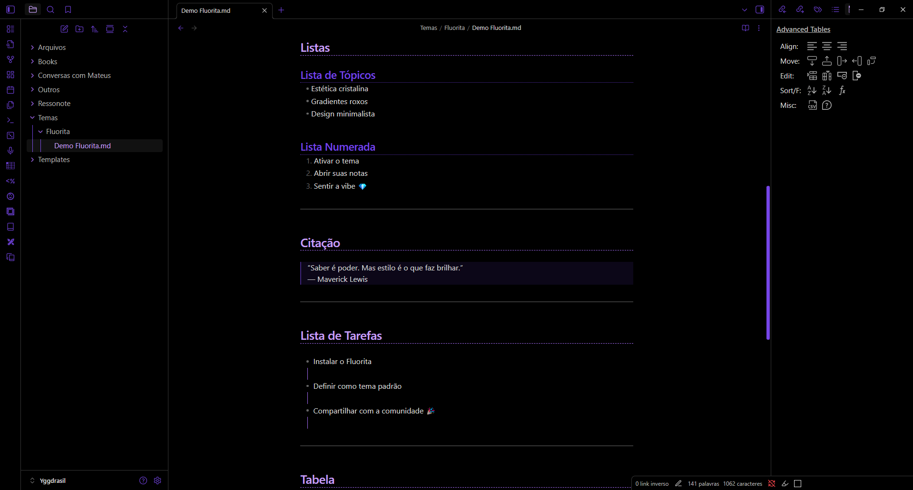
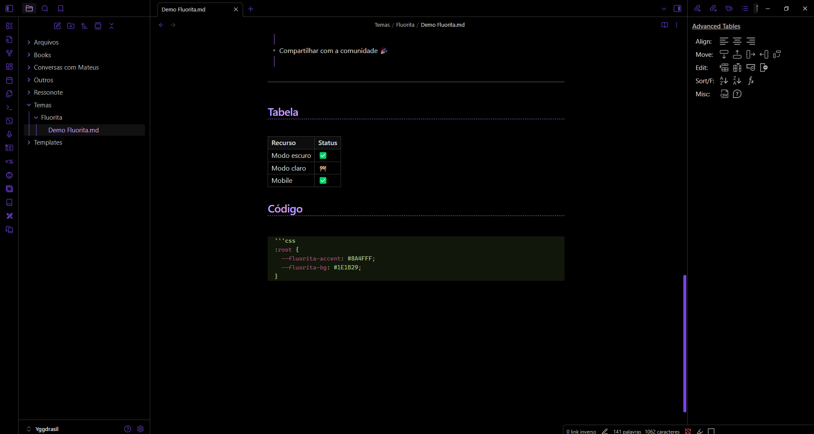

  

<h1 align="center">Obsidian Theme: Fluorita ✨</h1>

v0.0.1 | Designed & Coded by Maverick Lewis  
Crystal-inspired purple theme for Obsidian — blending elegance, minimalism, and a glowing modern aesthetic 💎

  
  
  

---

## 🌌 Screenshots

---

## 🎯 Objetivos do tema

- Destacar claramente a diferença entre **negrito**, *itálico*, ~~riscado~~, links internos e links externos  
- Alto contraste sem ser cansativo, mantendo a legibilidade  
- Títulos hierárquicos visivelmente distintos:
  - Cores diferentes  
  - Estilos de sublinhado diferenciados  
- Experiência consistente em **modo escuro** e **modo claro**  
- Totalmente funcional em dispositivos móveis  
- Atmosfera única, com um brilho roxo que remete ao cristal de fluorita 💜  

---

## 📥 Instalação

1. Vá até **Configurações > Aparência > Temas da comunidade** no Obsidian.  
2. Procure por **Fluorita** na galeria de temas.  
3. Clique em **Instalar** e depois **Usar**.  

---

## 💜 Apoie o Fluorita

Se você gostou do tema e quer apoiar meu trabalho, considere fazer uma doação:  

⭐ Ou, se preferir, apenas deixe uma **estrela** aqui no repositório — já ajuda muito!  

---

## 📜 Licença

Este projeto está licenciado sob a **Daxter License**.  
Veja o arquivo [LICENSE](./LICENSE) para mais detalhes.
